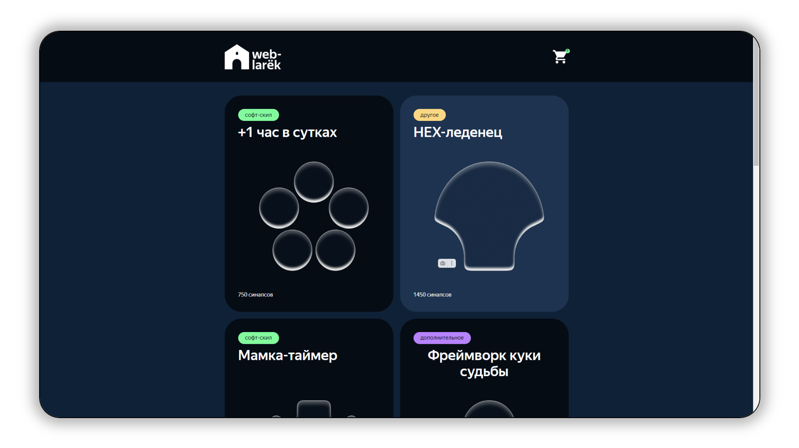
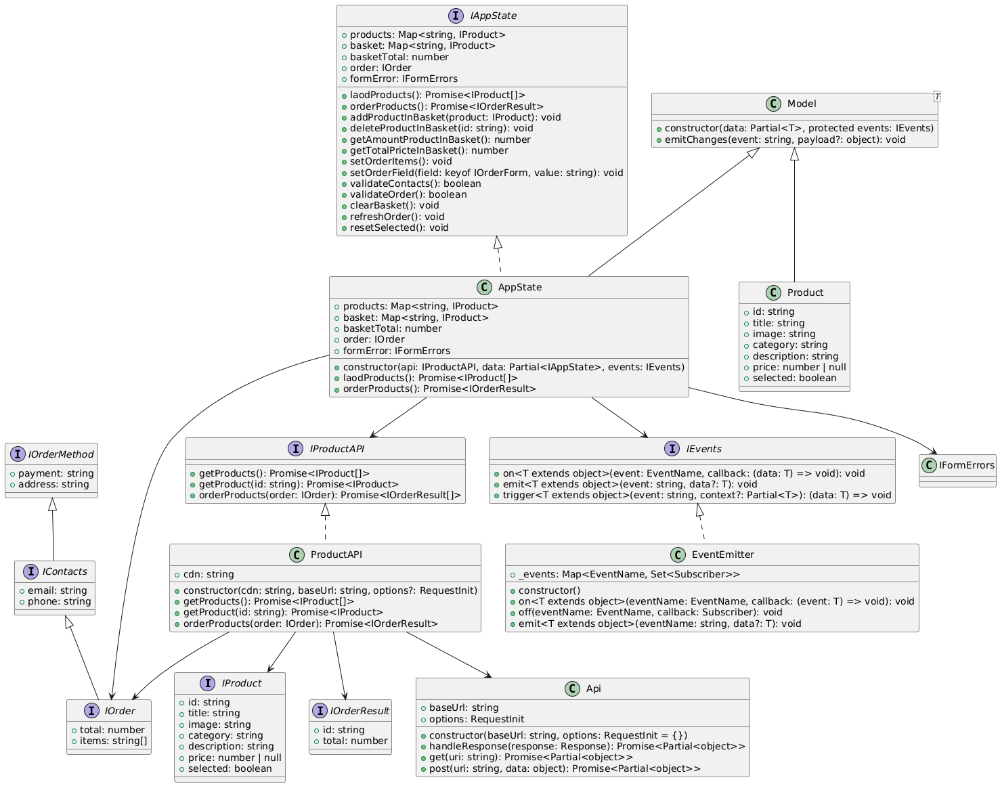

# "Веб-ларек"



## Стек
- HTML 
- SCSS 
- TS 
- Webpack

## Структура проекта:
- src/ — исходные файлы проекта
- src/components/ — папка с JS компонентами
- src/components/base/ — папка с базовым кодом
- src/components/model/ — папка с моделями данных
- src/components/view — папка с классами отображения
  - /base — папка с базовыми классами отображения
  - /partial — папка с конкретными классами отображения

## Важные файлы:
- src/pages/index.html — HTML-файл главной страницы
- src/types/index.ts — файл с типами
- src/index.ts — точка входа приложения
- src/scss/styles.scss — корневой файл стилей
- src/utils/constants.ts — файл с константами
- src/utils/utils.ts — файл с утилитами

## Установка и запуск
Для установки и запуска проекта необходимо выполнить команды

```
npm install
npm run start
```

или

```
yarn
yarn start
```
## Сборка

```
npm run build
```

или

```
yarn build
```

## Архитектура Приложения (MVC)

### Модели
  

### Отображение


[Description of the modules in English](./architecture.en.md) <-- click  
[Описание модулей на русском](./architecture.ru.md) <-- клик 

## Автор

** [Кирилл Дорошев (DKMFzF)](https://vk.com/dkmfzf ) **

## Лицензия

Этот проект распространяется по MIT лицензии  

Спасибо Яндекс Практикум!
